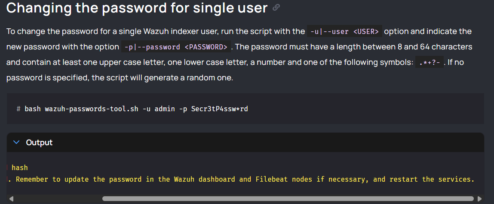

# Wazuh Password Rotation Runbook (Indexer + Dashboard)

## Purpose
This runbook provides a repeatable **step-by-step process** to rotate Wazuh Indexer user passwords (commonly `admin`) safely, verify functionality, and record the change.

It also includes a recommended **password rotation policy** (how often to change, triggers to rotate sooner, and how to document it).

---

## Scope
Applies to:
- Wazuh Indexer (OpenSearch)
- Wazuh Dashboard
- Optional: Wazuh Manager / Server nodes and Filebeat/shipper nodes if they authenticate to the Indexer

---

## Password Requirements (Tool Policy)
When setting a password via `wazuh-passwords-tool.sh`, it must:
- Be **8–64 characters**
- Include:
  - **≥ 1 uppercase** letter
  - **≥ 1 lowercase** letter
  - **≥ 1 number**
  - **≥ 1 symbol** from **this allowed set only**:

```
. * + ? -
```

⚠️ Notes:
- Characters like `!` and `#` may fail policy checks and/or shell parsing.
- Always wrap passwords in **single quotes** in the command.

---

## Pre-Change Checklist (Do This First)
1) Confirm you have console/SSH access in case Dashboard login breaks.
2) Identify where components run:
   - Is Dashboard on the same VM as the Indexer?
   - Are there separate Wazuh Manager/Filebeat nodes?
3) Have a planned maintenance window if this is production.

---

## Step-by-Step: Rotate the Indexer `admin` Password

### Step 1 — Go to the tool directory
```bash
cd /usr/share/wazuh-indexer/plugins/opensearch-security/tools
```

### Step 2 — Change the password
Use a policy-compliant password and **single quotes**.

```bash
bash wazuh-passwords-tool.sh -u admin -p 'NewPassword2026*'
```

Expected output includes:
- Updating internal users
- Backup saved
- Password hash generated
- Warning reminding you to update Dashboard/server/filebeat and restart services

### Step 3 — Verify the new credentials on the Indexer
```bash
curl -k -u admin:'NewPassword2026*' https://localhost:9200
```
Success looks like JSON containing `cluster_name`, `version`, etc.

---

## Step-by-Step: Update Wazuh Dashboard to Use the New Password

### Step 4 — Edit Dashboard config
File:
```bash
sudo nano /etc/wazuh-dashboard/opensearch_dashboards.yml
```

Set:
```yaml
opensearch.username: admin
opensearch.password: NewPassword2026*
```

### Step 5 — Restart Dashboard
```bash
sudo systemctl restart wazuh-dashboard
```

### Step 6 — Confirm Dashboard is healthy
```bash
sudo systemctl status wazuh-dashboard --no-pager -l
```

Optional: check logs if issues appear
```bash
sudo journalctl -u wazuh-dashboard -n 80 --no-pager
```

---

## Step-by-Step: Update Other Nodes (If Present)
Only do this if you have separate nodes that authenticate to the Indexer.

### Step 7 — Wazuh Manager / Server node
If the manager uses Indexer credentials, update the relevant config/keystore in your environment, then:
```bash
sudo systemctl restart wazuh-manager
```

### Step 8 — Filebeat / shipper nodes
If Filebeat sends to the Indexer using stored creds, update the keystore/credentials, then:
```bash
sudo systemctl restart filebeat
```

---

## Post-Change Validation
1) Indexer cluster health:
```bash
curl -k -u admin:'NewPassword2026*' https://localhost:9200/_cluster/health?pretty
```
2) Log into the Wazuh Dashboard UI and confirm:
- Pages load
- No “cannot connect to OpenSearch/Indexer” errors

---

## Backups / Rollback
The password tool creates an internal users backup at:
```bash
/etc/wazuh-indexer/internalusers-backup/
```

If you need to roll back, restore the prior internal users file from backup according to your operational standards, then restart the indexer and dashboard.

---

# Password Rotation Policy (When to Change It)

## Recommended Rotation Frequency
Use one of these approaches depending on your security posture:

### Option A — Modern best practice (recommended)
Rotate **only when needed**, and enforce:
- Strong unique passwords
- Least privilege
- MFA where applicable
- Monitoring and alerting

Rotate immediately if any trigger occurs (see below).

### Option B — Compliance-driven rotation
If your organization requires scheduled changes:
- **Every 90 days** for privileged accounts (e.g., `admin`)
- **Every 180 days** for non-privileged service accounts

Keep exceptions documented (e.g., when using vaulted/rotated secrets automatically).

## Rotate Immediately (Triggers)
Rotate the Indexer/Dashboard credentials ASAP if:
- A privileged account credential is exposed or suspected compromised
- An admin leaves the organization or a device is lost
- You detect unusual login activity or repeated failures
- Backup files, configs, or logs containing credentials are accessed improperly
- You changed related certificates/hosts and need to re-establish trusted access

## Additional Good Practices
- Prefer using a secrets manager/vault for storing credentials.
- Avoid sharing `admin` for services; use dedicated service accounts.
- Track who performed the change and confirm validation steps were completed.

---

# Change Record Template (Copy/Paste)

**Change Title:** Wazuh Indexer Password Rotation (admin)

**Date/Time (UTC):**

**Performed by:**

**Systems Affected:** Indexer, Dashboard, (Manager/Filebeat nodes if applicable)

**Reason:** Scheduled rotation / Incident response / Compromise suspicion / Other

**Commands Executed:**
- `bash wazuh-passwords-tool.sh -u admin -p '********'`
- `curl -k -u admin:'********' https://localhost:9200`
- Edited `/etc/wazuh-dashboard/opensearch_dashboards.yml`
- `systemctl restart wazuh-dashboard`

**Validation:**
- Indexer reachable: Yes/No
- Cluster health: green/yellow/red
- Dashboard login successful: Yes/No

**Backup Location:** `/etc/wazuh-indexer/internalusers-backup/`

**Notes / Issues:**

---

## Quick Troubleshooting
- **"Argument --password needs a second argument"** → your password started with `#` or had unquoted special chars; use single quotes.
- **Password policy error** → ensure you used symbols only from `. * + ? -` and include upper/lower/number.
- **Dashboard can’t connect** → update `/etc/wazuh-dashboard/opensearch_dashboards.yml`, restart dashboard, check `journalctl`.

## Screenshots


### Wazuh official



